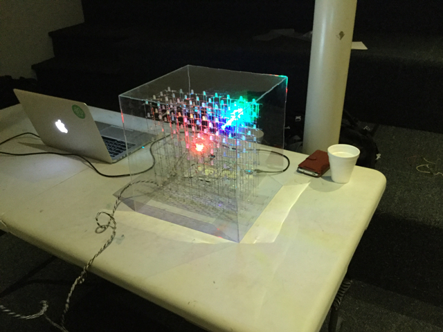

# Lattice Snake

## Setup

- `npm install`
- `gulp` to watch and develop

## Structure

- `/chrome` is a folder that can be loaded as a Chrome App
- You can also load the Chrome App by dragging `/snake.crx` to `chrome://extensions`
- `/photon` is the Photon app to be run with Particle Photon

## Usage

After both programs are loaded, open the Chrome App, click `Connect and Init` and then
`Send Data`.

## License

MIT
